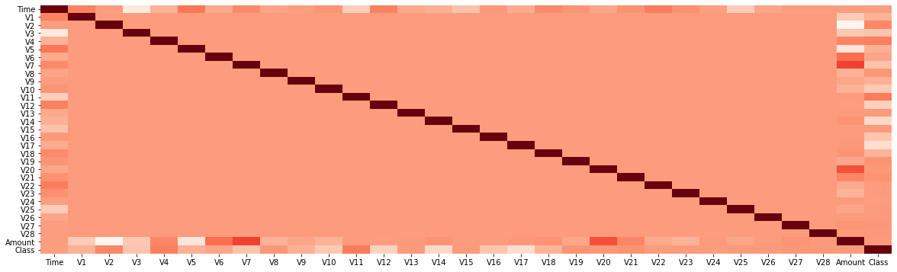
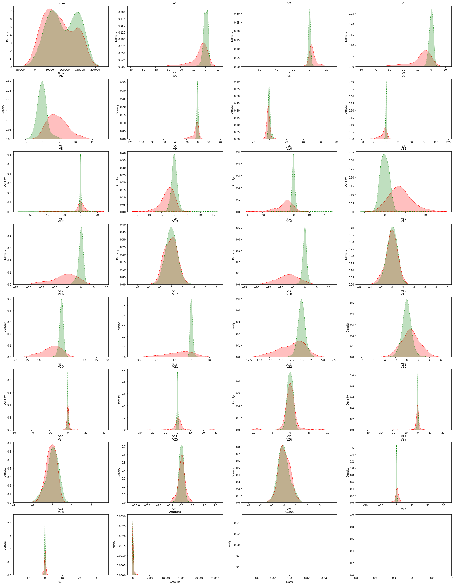

# Credit Card Fraud Detector
The goal of this project is to create a classifier which classify bank transactions into legitimate and fraudulent.
Data is widely available online. Example: https://www.kaggle.com/mlg-ulb/creditcardfraud.

About this data set:
The datasets contains transactions made by credit cards in September 2013 by european cardholders.
This dataset presents transactions that occurred in two days, where we have 492 frauds out of 284,807 transactions. The dataset is highly unbalanced, the positive class (frauds) account for 0.172% of all transactions.

It contains only numerical input variables which are the result of a PCA transformation. Unfortunately, due to confidentiality issues, we cannot provide the original features and more background information about the data. Features V1, V2, … V28 are the principal components obtained with PCA, the only features which have not been transformed with PCA are 'Time' and 'Amount'. Feature 'Time' contains the seconds elapsed between each transaction and the first transaction in the dataset. The feature 'Amount' is the transaction Amount, this feature can be used for example-dependant cost-senstive learning. Feature 'Class' is the response variable and it takes value 1 in case of fraud and 0 otherwise.
 
Our Classification Analysis kernel consists of 5 steps:

### Step 1 - Import Libraries and Data Set:
in addition to the scikit-learn library whhich we use to perform the classification analysis, we also use several other packages and modules:

- **Pandas**:used for data structures and operations for manipulating numerical tables
- **Numpy**: used for numerical analysis
- **matplotlib.pyplot**: used for plotting data
- **seaborn**: used for data visualization (used on top of matplotlib library)
- **sklearn**: used in our kernel to split the set into a training and a testing set, to create the model, and to visualize the results.

We import the data from a csv file, and we load it into a pandas DataFrame object.

### Step 2 - Visualize Data:
We check our data for null values, and we check if there is any correlation between the variables. The data is largely not correlated, stemming from the fact that the parameters are a result of PCA.

To perform feature selection, we create a series of graphs for each feature from V1 to V28 in addition to Time and Amount, and we use the target as the hue in order to determine if the feature adds value to the model.

### Step 3 - Create Training and Testing Set: 
We choose the most valualble features, and we split our data set into a training and testing sets. We use 20% for testing the classifier:

- **X_train**: Contains the independent variables used for training
- **y_train**: Contains the dependent variables used for training
- **X_test**:	Contains the independent variables used for testing
- **y_test**:	Contains Dependent variables used for testing

### Step 4 - Train Model
To create the Naïve Bayes Model, we instantiate an object from the sklearn's GaussianNB module and we fit it to our data.

### Step 5 - Evaluate Model:
We classify the data and we use a confusion matrix to visualize results. We also generate a classification report which gives you the f1 score.
